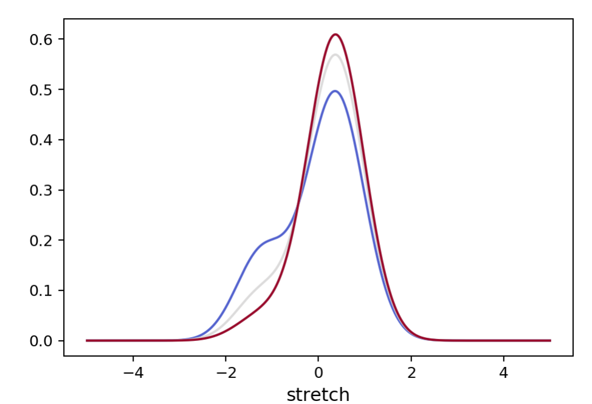

# snage
Type Ia supernova prompt vs delayed underlying population

# Installation

using git

# Concept

The package is made to generate random sample realisation of SN sample as they are in nature (i.e. prior selection function). 
Conceptually, SNe Ia are assumed to be sample mixture of underlying populations that each have their own intrinsic distribution of properties. These may be redshift dependent as well as the mixture composition.

Currently, only the Prompt and Delayed dichotomy has been implemented based on [Rigault et al. 2018](https://ui.adsabs.harvard.edu/abs/2018arXiv180603849R/abstract) and [Nicolas et al. 2O20](https://ui.adsabs.harvard.edu/abs/2020arXiv200509441N/abstract). 

Underlying distributions of SN properties such as stretch, color or host mass have been modelled for both prompt and delayed populations. Gaussian, Gaussian mixture or asymetric Gaussians are currently used for this modelling and default distribution parameters are provided. One can then draw random sample realisations assuming a fraction of prompt SNeIa. This way the underlying correlation between all the SN properties are accurately handled, assuming they as solely due to their correlation with the age population.

# Current limits

The prompt and delayed modeling of the host mass step is not satisfying yet:
 - It is not redshift dependent while it must
 - Even at z~0 it is not great yet.
 
# Usage

Load an instance of the prompt and delayed object (`PrompDelayModel`)

```python
from snprop import age
pdmodel = age.PrompDelayModel()
```

To vizualise the underlying distribution of say, stretch, at _z=0.05_, _z=0.5_ and _z=1_

```python
fig = pdmodel.show_pdf("stretch", z=[0.05, 0.5, 1], zmax=1)
```

