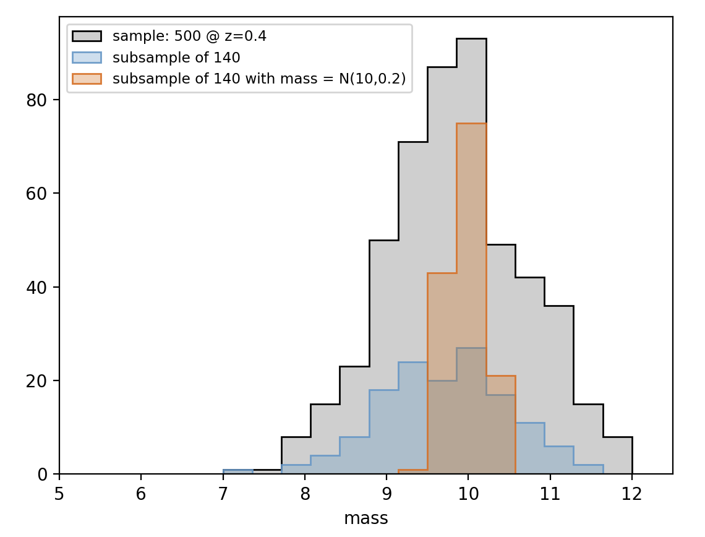
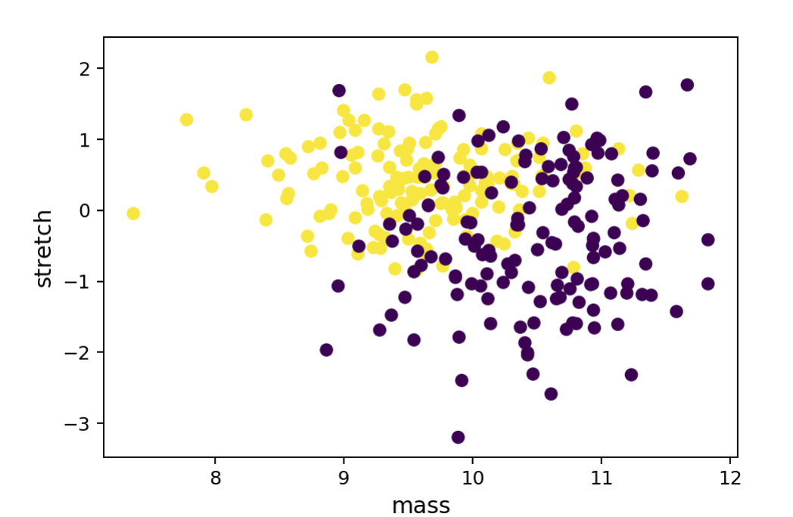

# snprop
Type Ia supernova underlying population distribution modelling.

# Installation

```bash
git clone https://github.com/MickaelRigault/snprop.git
cd snprop
python setup.py install
```

# Concept

The package is made to generate random sample realisation of SN sample as they are in nature (i.e. prior selection function). 
Conceptually, SNe Ia are assumed to be sample mixture of underlying populations that each have their own intrinsic distribution of properties. These may be redshift dependent as well as the mixture composition.

Currently, only the Prompt and Delayed dichotomy has been implemented based on [Rigault et al. 2018](https://ui.adsabs.harvard.edu/abs/2018arXiv180603849R/abstract) and [Nicolas et al. 2O20](https://ui.adsabs.harvard.edu/abs/2020arXiv200509441N/abstract). 
[dev] implementation of the Survey based asymetric gaussian distribution, a la Scolnic & Kessler 2017.

Underlying distributions of SN properties such as stretch, color or host mass have been modelled for both prompt and delayed populations. Gaussian, Gaussian mixture or asymetric Gaussians are currently used for this modelling and default distribution parameters are provided. One can then draw random sample realisations assuming a fraction of prompt SNeIa. This way the underlying correlation between all the SN properties are accurately handled, assuming they as solely due to their correlation with the age population.

# Current limits

The prompt and delayed modeling of the host mass step is not satisfying yet:
 - It is not redshift dependent while it must
 - Even at z~0 it is not great yet.
 
# Usage

## Loading a PromptDelayModel instance
Load an instance of the prompt and delayed object (`PrompDelayModel`)

```python
from snprop import age
pdmodel = age.PrompDelayModel()
```

## Draw a random SN sample.
Then to draw a random realisation of a sample of 200 SNeIa, at `z=0.4`, simply do:

```python
pdmodel.draw_sample(0.4, size=200)
```
the sample is stored as a pandas datafraom in `pdmodel.sample`
```python
print(pdmodel.sample)
|     |        color |    stretch |   age |     mass |          hr |   z |,
|----:|-------------:|-----------:|------:|---------:|------------:|----:|,
|   0 | -0.0666667   |  1.20621   |     1 | 10.9329  | -0.125125   | 0.4 |,
|   1 | -0.063964    |  1.54655   |     1 |  9.47548 |  0.0950951  | 0.4 |,
|   2 |  0.0612613   |  0.525526  |     1 |  9.73473 | -0.047047   | 0.4 |,
...
| 197 |  0.0234234   |  1.07608   |     0 | 11.1782  | -0.0710711  | 0.4 |,
| 198 |  0.0342342   |  1.03604   |     0 | 10.2392  |  0.023023   | 0.4 |,
| 199 |  0.0603604   | -0.195195  |     0 | 10.7227  | -0.0830831  | 0.4 |
```

You can also provide a list of redshift as `z` and `size` would be the number of draw per redshift element, i.e.:
```python
pdmodel.draw_sample(z=np.linspace(0.001,0.5, 100), size=2)
```

```python
pdmodel.sample

|     |        color |     stretch |   age |     mass |          hr |         z |,
|----:|-------------:|------------:|------:|---------:|------------:|----------:|,
|   0 | -0.0513514   | -0.435435   |     0 | 10.6106  | -0.209209   | 0.001     |,
|   1 |  0.0306306   | -0.035035   |     0 | 11.3253  | -0.035035   | 0.001     |,
|   2 | -0.0918919   |  0.385385   |     0 | 11.2272  | -0.127127   | 0.0060404 |,
|   3 |  0.0774775   |  0.895896   |     0 |  9.86086 | -0.189189   | 0.0060404 |,
|   4 |  0.0135135   |  0.365365   |     1 |  9.29329 |  0.037037   | 0.0110808 |,
...
| 195 | -0.0558559   | -0.805806   |     0 | 10.0991  |  0.0530531  | 0.489919  |,
| 196 |  0.0315315   |  0.865866   |     1 |  9.58759 | -0.0510511  | 0.49496   |,
| 197 | -0.0333333   |  0.895896   |     1 | 10.1271  |  0.003003   | 0.49496   |,
| 198 | -0.0351351   |  0.415415   |     1 |  8.93594 | -0.049049   | 0.5       |,
| 199 | -0.0747748   | -1.62663    |     0 | 10.2603  |  0.003003   | 0.5       |
```
#### How is the sample built ?
First, the SN ages are randomly drawn following the underlying probability of young (1) and old (0) SNe Ia at a given redshift.
Then for each age (1 or 0) the SN parameters are randomly drawn following the underlying distribution associated to this age population.

#### Fraction of prompt as a function of redshift.

pdmodel has a method `deltaz(z)` that returns the fraction of prompt at the given z ; z can by a list/array. This is what is used by `pdmodel.show_pdf()`

## Draw a subsample

Let's imagine you only to randomly draw 140 targets from the sample you previously constructed, simply do:
```python
sub_dataframe = pdmodel.get_subsample(140)
```

Now, if you want to get a subsample that follows a given distribution a parameter, e.g. a mass normally distributed at `10^10` with a dispersion of `0.2 dex`:
```python
from scipy import stats
index_pdf = stats.norm.pdf(pdmodel.sample["mass"], loc=10, scale=0.2)
weightedsub_dataframe = pdmodel.get_subsample(140, index_pdf=index_pdf)
```
<p align="left">
  
</p>


#### Remark about weighted draw
If you parameters used to weight the indexes is non-trivially connected to the age parameters, then the fraction of young/old (1/0) will be changed in the subsample, thus so are the SN properties connected to age, like the stretch.

## Parameter distributions

To vizualise the underlying distribution of say, stretch, at _z=0.05_, _z=0.5_ and _z=1_ (the color is the redshift (blue to red) up to, in that case, `zmax=1`.

```python
fig = pdmodel.show_pdf("stretch", z=[0.05, 0.5, 1], zmax=1)
```

<p align="left">
  
</p>

### Change the underlying population properties

The pdmodel install has all the `set_distprop_{which}` methods where `which` is any of the SN property. Change that to change the modeling. 

## Parameter correlations

If two parameters are non-trivially connected to age, they will be correlated. 
To visualise the correlation between two SN properties, say e.g. stretch and mass:

```python
fig = pdmodel.show_scatter("mass","stretch", colorkey="age")
```
<p align="left">
  
</p>
